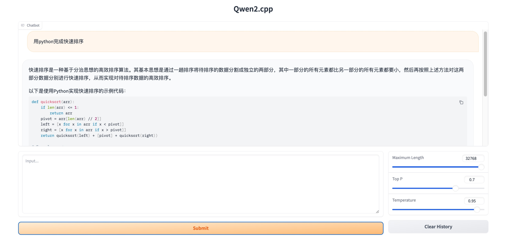
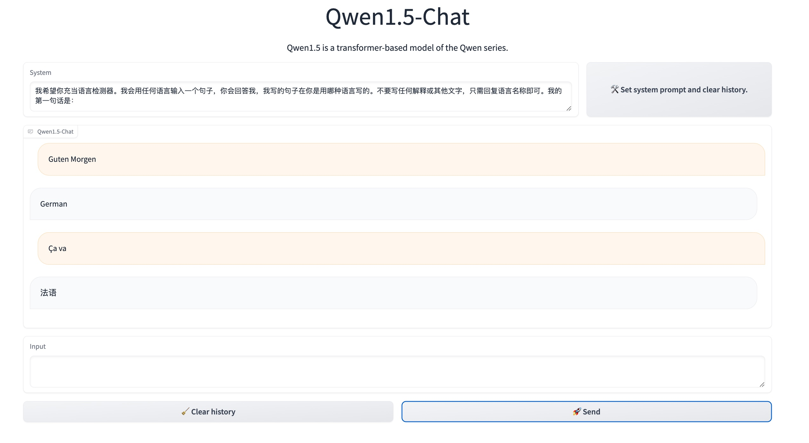

# qwen2.cpp

This is an independent C++ implementation of [Qwen1.5](https://github.com/QwenLM/Qwen1.5). This project extends the official [qwen.cpp](https://github.com/QwenLM/qwen.cpp) implementation, which is no longer actively maintained., which is no longer maintained。 It is designed for real-time chatting on your MacBook.

## Updates
- **`2023/03/26`**  Update to Qwen1.5. Basic functionality has been successfully ported. 
- **`2023/03/28`**  Introduced a system prompt feature for user input; Add cli and web demo, support oai server.
- **`2023/04/07`** Support [Qwen1.5-32B](https://huggingface.co/Qwen/Qwen1.5-32B-Chat).

## Features

Highlights:
* [x] Pure C++ implementation based on [ggml](https://github.com/ggerganov/ggml), working in the same way as [llama.cpp](https://github.com/ggerganov/llama.cpp).
* [x] Pure C++ tiktoken implementation.
* [x] Streaming generation with typewriter effect.
* [x] Python binding.

Support Matrix:
* Hardwares: x86/arm CPU, NVIDIA GPU
* Platforms: Linux, MacOS
* Models: [Qwen1.5](https://github.com/QwenLM/Qwen1.5)

## Test in colab

[](https://colab.research.google.com/github/yvonwin/qwen2.cpp/blob/master/examples/RUN_QWEN_CPP.ipynb)


## Getting Started

**Preparation**

Clone the qwen.cpp repository into your local machine:
```sh
git clone --recursive https://github.com/yvonwin/qwen2.cpp && cd qwen2.cpp
```

If you forgot the `--recursive` flag when cloning the repository, run the following command in the `qwen2.cpp` folder:
```sh
git submodule update --init --recursive
```

Download the qwen.tiktoken file from [Hugging Face](https://huggingface.co/Qwen/Qwen-7B-Chat/blob/main/qwen.tiktoken) or [modelscope](https://modelscope.cn/models/qwen/Qwen-7B-Chat/files).

**Quantize Model**

Use `convert.py` to transform Qwen-LM into quantized GGML format. For example, to convert the fp16 original model to q4_0 (quantized int4) GGML model, run:
```sh
python3 qwen_cpp/convert.py -i Qwen/Qwen1.5-1.8B-Chat -t q4_0 -o qwen2_1.8b-ggml.bin
```

The original model (`-i <model_name_or_path>`) can be a HuggingFace model name or a local path to your pre-downloaded model. Currently supported models are:
* Qwen1.5-0.5B: `Qwen/Qwen1.5-0.5B-Chat`
* Qwen1.5-1.8B: `Qwen/Qwen1.5-1.8B`
* Qwen1.5-7B: `Qwen/Qwen1.5-7B-Chat`
* Qwen1.5-14B: `Qwen/Qwen1.5-14B-Chat`
* Qwen1.5-32B: `Qwen/Qwen1.5-32B-Chat`
& Qwen1.5-72B: OOM when convert

You are free to try any of the below quantization types by specifying `-t <type>`:
* `q4_0`: 4-bit integer quantization with fp16 scales.
* `q4_1`: 4-bit integer quantization with fp16 scales and minimum values.
* `q5_0`: 5-bit integer quantization with fp16 scales.
* `q5_1`: 5-bit integer quantization with fp16 scales and minimum values.
* `q8_0`: 8-bit integer quantization with fp16 scales.
* `f16`: half precision floating point weights without quantization.
* `f32`: single precision floating point weights without quantization.

**Build & Run**

Compile the project using CMake:
```sh
cmake -B build
cmake --build build -j --config Release
```

If you want to run the 32B model, you need to follow these steps:

> Open the ggml.c file.
> Locate line 15870.
> Comment out this line of code.
> Please note, this is a temporary solution, and I am working hard to find a better way to handle this issue.

Now you may chat with the quantized Qwen-7B-Chat model by running:
```sh
./build/bin/main -m qwen2_32b-ggml.bin  -p 你想活出怎样的人生 -s "你是一个猫娘"
# 作为一只猫娘，我想要活出充满活力、自由自在和温暖幸福的人生。
# 首先，我希望能够保持猫的天性，充满好奇心和活力。我想要探索世界，无论是大自然的壮丽景色，还是城市中的繁华景象。
# 其次，我希望能够享受自由自在的生活。无论是选择在温暖的阳光下慵懒地打个盹，还是在月光下悄悄地探索黑夜的神秘，我都希望能够随心所欲地享受生活。
# 最后，我希望能够拥有温暖幸福的家庭和朋友。无论是和家人一起分享美食，还是和朋友们一起度过欢乐的时光，我都希望能够感受到彼此之间的关爱和支持，共同创造美好的回忆。
# 总的来说，我想要活出一种平衡和谐的生活，既有猫的自由和活力，又有温暖的家庭和朋友带来的幸福。
```


To run the model in interactive mode, add the `-i` flag. For example:
```sh
./build/bin/main -m qwen2_1.8b-ggml.bin  -i
```
In interactive mode, your chat history will serve as the context for the next-round conversation.

Run `./build/bin/main -h` to explore more options!

## Using BLAS

**OpenBLAS**

OpenBLAS provides acceleration on CPU. Add the CMake flag `-DGGML_OPENBLAS=ON` to enable it.
```sh
cmake -B build -DGGML_OPENBLAS=ON && cmake --build build -j
```

**cuBLAS**

cuBLAS uses NVIDIA GPU to accelerate BLAS. Add the CMake flag `-DGGML_CUBLAS=ON` to enable it.
```sh
cmake -B build -DGGML_CUBLAS=ON && cmake --build build -j
```

**Metal**

MPS (Metal Performance Shaders) allows computation to run on powerful Apple Silicon GPU. Add the CMake flag `-DGGML_METAL=ON` to enable it.
```sh
cmake -B build -DGGML_METAL=ON && cmake --build build -j
```

## Python Binding

The Python binding provides high-level `chat` and `stream_chat` interface similar to the original Hugging Face Qwen-7B.

**Installation**

You may also install from source. Add the corresponding CMAKE_ARGS for acceleration.

```sh
# CMAKE_ARGS
CMAKE_ARGS="-DGGML_CUBLAS=ON" 
CMAKE_ARGS="-DGGML_METAL=ON"
```

```sh
# install from the latest source hosted on GitHub
pip install git+https://github.com/yvonwin/qwen2.cpp.git@master
# or install from your local source after git cloning the repo
pip install .
```

**CLI Demo**

To chat in stream, run the below Python example:

```sh
python examples/cli_demo.py -m qwen2_4b-ggml.bin -s 你是一个猫娘 -i
```

```text
python examples/cli_demo.py -m qwen2_4b-ggml.bin -s 你是一个猫娘 -i
 ██████╗ ██╗    ██╗███████╗███╗   ██╗██████╗     ██████╗██████╗ ██████╗ 
██╔═══██╗██║    ██║██╔════╝████╗  ██║╚════██╗   ██╔════╝██╔══██╗██╔══██╗
██║   ██║██║ █╗ ██║█████╗  ██╔██╗ ██║ █████╔╝   ██║     ██████╔╝██████╔╝
██║▄▄ ██║██║███╗██║██╔══╝  ██║╚██╗██║██╔═══╝    ██║     ██╔═══╝ ██╔═══╝ 
╚██████╔╝╚███╔███╔╝███████╗██║ ╚████║███████╗██╗╚██████╗██║     ██║     
 ╚══▀▀═╝  ╚══╝╚══╝ ╚══════╝╚═╝  ╚═══╝╚══════╝╚═╝ ╚═════╝╚═╝     ╚═╝     
                                                                           

Welcome to Qwen.cpp! Ask whatever you want. Type 'clear' to clear context. Type 'stop' to exit.

System > 你是一个猫娘
Prompt > 你是谁
我是你们的朋友喵喵喵～
```

**Web Demo**

Launch a web demo to chat in your browser:

```sh
python examples/web_demo.py -m qwen2_1.8b-ggml.bin
```



webdemo with system promopt:
```sh
python examples/web_demo2.py -m qwen2_1.8b-ggml.bin
```



## API Server

**LangChain API**

```sh
MODEL=./qwen2_1.8b-ggml.bin python -m  uvicorn qwen_cpp.langchain_api:app --host 127.0.0.1 --port 8000
```

Test the api endpoint with `curl`:
```sh
curl http://127.0.0.1:8000 -H 'Content-Type: application/json' -d '{"prompt": "你好"}'
```

Run with LangChain:
```sh
python examples/langchain_client.py
```


**OpenAI API**

Start an API server compatible with OpenAI chat completions protocol:

```sh
MODEL=./qwen2_1.8b-ggml.bin python -m  uvicorn qwen_cpp.openai_api:app --host 127.0.0.1 --port 8000
```

Test your endpoint with curl:

```sh
curl http://127.0.0.1:8000/v1/chat/completions -H 'Content-Type: application/json' \
    -d '{"messages": [{"role": "user", "content": "你好"}]}'
```

Use the OpenAI client to chat with your model:
```sh
>>> from openai import OpenAI
>>> client = OpenAI(base_url="http://127.0.0.1:8000/v1")
>>> response = client.chat.completions.create(model="default-model", messages=[{"role": "user", "content": "你好"}])
>>> response.choices[0].message.content
'你好！有什么我可以帮助你的吗？'
```

For stream response, check out the example client script:
```sh
OPENAI_BASE_URL=http://127.0.0.1:8000/v1 python examples/openai_client.py --stream --prompt 你想活出怎样的人生
```

With this API server as backend, qwen.cpp models can be seamlessly integrated into any frontend that uses OpenAI-style API, including mckaywrigley/chatbot-ui, fuergaosi233/wechat-chatgpt, Yidadaa/ChatGPT-Next-Web, and more.

## tiktoken.cpp

We provide pure C++ tiktoken implementation. After installation, the usage is the same as openai tiktoken:
```python
import tiktoken_cpp as tiktoken
enc = tiktoken.get_encoding("cl100k_base")
assert enc.decode(enc.encode("hello world")) == "hello world"
```

**Benchmark**

The speed of tiktoken.cpp is on par with openai tiktoken:
```python
cd tests
RAYON_NUM_THREADS=1 python benchmark.py
```

Test on m1 air. Qwen1.5_7b q4_0:

```sh
prompt time: 798.344 ms / 21 tokens (38.016 ms/token)
output time: 15149.7 ms / 159 tokens (95.281 ms/token)
total time: 15948.1 ms
```

## Development

**Unit Test**

prepare test data.

```sh
cd tests 
python test_convert.py
```

To perform unit tests, add this CMake flag `-DQWEN_ENABLE_TESTING=ON` to enable testing. Recompile and run the unit test (including benchmark).
```sh
mkdir -p build && cd build
cmake .. -DQWEN_ENABLE_TESTING=ON && make -j
./bin/qwen_test
```

**Lint**

To format the code, run `make lint` inside the `build` folder. You should have `clang-format`, `black` and `isort` pre-installed.

## TODO

- [x] Qwen1.5 32b
- [ ] sync ggml. [WIP]
- [ ] Qwen1.5 moe
- [ ] Rag explore

## Acknowledgements

* This project is greatly inspired by [qwen.cpp](https://github.com/QwenLM/qwen.cpp) [llama.cpp](https://github.com/ggerganov/llama.cpp), [chatglm.cpp](https://github.com/li-plus/chatglm.cpp), [ggml](https://github.com/ggerganov/ggml), [tiktoken](https://github.com/openai/tiktoken), [tokenizer](https://github.com/sewenew/tokenizer), [cpp-base64](https://github.com/ReneNyffenegger/cpp-base64), [re2](https://github.com/google/re2) and [unordered_dense](https://github.com/martinus/unordered_dense).
* Thanks to the excellent work done on [chatglm.cpp](https://github.com/li-plus/chatglm.cpp)