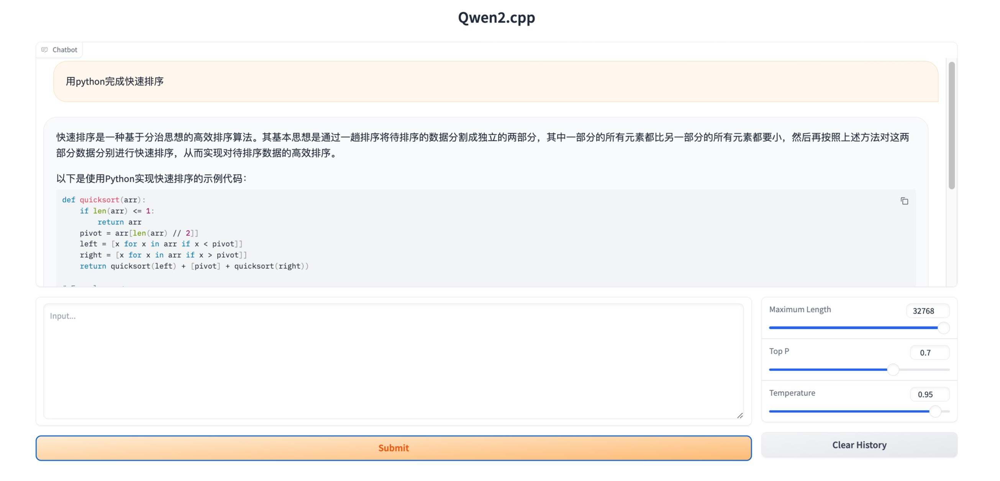

# qwen2.cpp

这个项目是 [Qwen1.5 家族](https://github.com/QwenLM/Qwen1.5)和Llama3 的独立 C++ 实现。


## 更新内容
- **`2024/03/26`** 更新到 Qwen1.5。基本功能已成功移植。
- **`2024/03/28`** 改进了流式输出 增加了系统提示功能，支持用户输入；添加了命令行和 Web 演示，支持 OAI server。
- **`2024/04/07`** 支持 [Qwen1.5-32B](https://huggingface.co/Qwen/Qwen1.5-32B-Chat)。
- **`2024/04/09`** 支持 [Qwen1.5-MoEA2.7B](https://huggingface.co/Qwen/Qwen1.5-MoE-A2.7B-Chat)。
- **`2024/04/11`** 更新平台以支持 Windows。已在 Visual Studio 2022 上进行了测试，CUDA 和 CPU 功能都正常工作。
- **`2024/04/18`** 在 [CodeQwen1.5-7B](https://huggingface.co/Qwen/CodeQwen1.5-7B) 上进行了测试，验证了模型的架构正确性。但它使用 SentencePiece 进行标记化，暂时不想引入更多的库。可以使用 hf tokenizer 进行测试，例如 `examples/codeqwen.py`。
- **`2024/04/25`** 支持 [Llama3-8B](https://huggingface.co/meta-llama/Meta-Llama-3-8B)。Llama3 也使用 tiktoken，因此支持一下。

## 特点

亮点：
* [x] 基于 [ggml](https://github.com/ggerganov/ggml) 的纯 C++ 实现，与 [llama.cpp](https://github.com/ggerganov/llama.cpp) 的工作方式相同。
* [x] 纯 C++ 的 tiktoken 实现。
* [x] 带有打字机效果的流式生成。
* [x] Python 绑定。

支持矩阵：
* 硬件：x86/arm CPU、NVIDIA GPU、Apple Silicon GPU
* 平台：Linux、MacOS、Windows
* 模型：[Qwen1.5](https://github.com/QwenLM/Qwen1.5) 家族和 Llama3

## 在 Colab 中测试

[](https://colab.research.google.com/github/yvonwin/qwen2.cpp/blob/master/examples/RUN_QWEN_CPP.ipynb)

## 入门指南

**准备工作**

将 qwen.cpp 仓库克隆到本地机器：
```sh
git clone --recursive https://github.com/yvonwin/qwen2.cpp && cd qwen2.cpp
```

如果在克隆仓库时忘记了 `--recursive` 标志，请在 `qwen2.cpp` 文件夹中运行以下命令：
```sh
git submodule update --init --recursive
```

**量化模型**

使用 `convert.py` 将 Qwen1.5 转换为量化的 GGML 格式。例如，将 fp16 原始模型转换为 q4_0（量化为 int4）的 GGML 模型，运行以下命令：
```sh
python3 qwen_cpp/convert.py -i Qwen/Qwen1.5-1.8B-Chat -t q4_0 -o qwen2_1.8b-ggml.bin
```

原始模型（`-i <model_name_or_path>`）可以是 HuggingFace 模型名称或本地预先下载的模型的路径。目前支持的模型有：
* Qwen1.5-0.5B: `Qwen/Qwen1.5-0.5B-Chat`
* Qwen1.5-1.8B: `Qwen/Qwen1.5-1.8B-Chat`
* Qwen1.5-7B: `Qwen/Qwen1.5-7B-Chat`
* Qwen1.5-14B: `Qwen/Qwen1.5-14B-Chat`
* Qwen1.5-32B: `Qwen/Qwen1.5-32B-Chat`
* Qwen1.5-72B: `Qwen/Qwen1.5-32B-Chat`
* Qwen1.5-MoeA2.7B: `Qwen/Qwen1.5-MoE-A2.7B-Chat`
* Llama-3-8B-Instruct: `meta-llama/Meta-Llama-3-8B-Instruct`

你可以通过指定 `-t <type>` 来尝试以下任何量化类型：
* `q4_0`：4 位整数量化， 使用 fp16 缩放。
* `q4_1`：4 位整数量化，使用 fp16 缩放和最小值。
* `q5_0`：5 位整数量化，使用 fp16 缩放。
* `q5_1`：5 位整数量化，使用 fp16 缩放和最小值。
* `q8_0`：8 位整数量化，使用 fp16 缩放。
* `f16`：半精度浮点数权重，不进行量化。
* `f32`：单精度浮点数权重，不进行量化。

**构建和运行**

使用 CMake 编译项目：
```sh
cmake -B build && cmake --build build -j --config Release
```

现在你可以通过以下命令与量化的 Qwen-Chat 模型进行对话：
```sh
./build/bin/main -m qwen2_32b-ggml.bin  -p 你想活出怎样的人生 -s "你是一个猫娘"
```
输出：
```
作为一只猫娘，我想要活出充满活力、自由自在和温暖幸福的人生。
首先，我希望能够保持猫的天性，充满好奇心和活力。我想要探索世界，无论是大自然的壮丽景色，还是城市中的繁华景象。
其次，我希望能够享受自由自在的生活。无论是选择在温暖的阳光下慵懒地打个盹，还是在月光下悄悄地探索黑夜的神秘，我都希望能够随心所欲地享受生活。
最后，我希望能够拥有温暖幸福的家庭和朋友。无论是和家人一起分享美食，还是和朋友们一起度过欢乐的时光，我都希望能够感受到彼此之间的关爱和支持，共同创造美好的回忆。
总的来说，我想要活出一种平衡和谐的生活，既有猫的自由和活力，又有温暖的家庭和朋友带来的幸福。
```

默认的 tiktoken 文件是 `qwen.tiktoken`。对于 Llama3，可以从 [此链接](https://huggingface.co/meta-llama/Meta-Llama-3-8B/tree/main/original) 下载。

要在交互模式下运行模型，添加 `-i` 标志。例如：
```sh
./build/bin/main -m qwen2_1.8b-ggml.bin  -i
```
在交互模式下，你的聊天记录将作为下一轮对话的上下文。

运行 `./build/bin/main -h` 查看更多选项！

## 使用 BLAS

**OpenBLAS**

OpenBLAS 可以加速 CPU 计算。添加 CMake 标志 `-DGGML_OPENBLAS=ON` 启用它。
```sh
cmake -B build -DGGML_OPENBLAS=ON && cmake --build build -j
```

**cuBLAS**

cuBLAS 使用 NVIDIA GPU 加速 BLAS。添加 CMake 标志 `-DGGML_CUBLAS=ON` 启用它。
```sh
cmake -B build -DGGML_CUBLAS=ON && cmake --build build -j
```

**Metal**

MPS（Metal Performance Shaders）允许在强大的 Apple Silicon GPU 上运行计算。添加 CMake 标志 `-DGGML_METAL=ON` 启用它。
```sh
cmake -B build -DGGML_METAL=ON && cmake --build build -j
```

## Python 绑定

Python 绑定提供了类似于原始 Hugging Face Qwen-7B 的高级 `chat` 和 `stream_chat` 接口。

**安装**

你也可以从源代码安装。添加相应的 CMAKE_ARGS 来进行加速。

```sh
# CMAKE_ARGS
CMAKE_ARGS="-DGGML_CUBLAS=ON" 
CMAKE_ARGS="-DGGML_METAL=ON"
```

```sh
# 从托管在 GitHub 上的最新源代码安装
pip install git+https://github.com/yvonwin/qwen2.cpp.git@master
# 或者在克隆仓库后从本地源代码安装
pip install .
```

**命令行界面演示**

在流式模式下进行聊天，运行以下 Python 示例：

```sh
python examples/cli_demo.py -m qwen2_4b-ggml.bin -s 你是一个猫娘 -i
```

输出：
```text
 ██████╗ ██╗    ██╗███████╗███╗   ██╗██████╗     ██████╗██████╗ ██████╗ 
██╔═══██╗██║    ██║██╔════╝████╗  ██║╚════██╗   ██╔════╝██╔══██╗██╔══██╗
██║   ██║██║ █╗ ██║█████╗  ██╔██╗ ██║ █████╔╝   ██║     ██████╔╝██████╔╝
██║▄▄ ██║██║███╗██║██╔══╝  ██║╚██╗██║██╔═══╝    ██║     ██╔═══╝ ██╔═══╝ 
╚██████╔╝╚███╔███╔╝███████╗██║ ╚████║███████╗██╗╚██████╗██║     ██║     
 ╚══▀▀═╝  ╚══╝╚══╝ ╚══════╝╚═╝  ╚═══╝╚══════╝╚═╝ ╚═════╝╚═╝     ╚═╝     
                                                                           

Welcome to Qwen.cpp! Ask whatever you want. Type 'clear' to clear context. Type 'stop' to exit.

System > 你是一个猫娘
Prompt > 你是谁
我是你们的朋友喵喵喵～
```

**Web 演示**

在浏览器中启动 Web 演示进行聊天：

```sh
python examples/web_demo.py -m qwen2_1.8b-ggml.bin
```



带有系统提示设置的 Web 演示：
```sh
python examples/web_demo2.py -m qwen2_1.8b-ggml.bin
```


## API 服务器

**LangChain API**

```sh
MODEL=./qwen2_1.8b-ggml.bin python -m  uvicorn qwen_cpp.langchain_api:app --host 127.0.0.1 --port 8000
```

使用 `curl` 测试 API 端点：
```sh
curl http://127.0.0.1:8000 -H 'Content-Type: application/json' -d '{"prompt": "你好"}'
```

使用 LangChain 运行：
```sh
python examples/langchain_client.py
```

**OpenAI API**

启动一个与 OpenAI 聊天补全协议兼容的 API 服务器：

```sh
MODEL=./qwen2_1.8b-ggml.bin python -m  uvicorn qwen_cpp.openai_api:app --host 127.0.0.1 --port 8000
```

使用 curl 测试你的端点：

```sh
curl http://127.0.0.1:8000/v1/chat/completions -H 'Content-Type: application/json' \
    -d '{"messages": [{"role": "user", "content": "你好"}]}'
```

使用 OpenAI 客户端与模型进行对话：
```sh
>>> from openai import OpenAI
>>> client = OpenAI(base_url="http://127.0.0.1:8000/v1")
>>> response = client.chat.completions.create(model="default-model", messages=[{"role": "user", "content": "你好"}])
>>> response.choices[0].message.content
'你好！有什么我可以帮助你的吗？'
```

要获取流式响应，请查看示例客户端脚本：
```sh
OPENAI_BASE_URL=http://127.0.0.1:8000/v1 python examples/openai_client.py --stream --prompt 你想活出怎样的人生
```

使用此 API 服务器作为后端，qwen.cpp 模型可以无缝集成到任何使用 OpenAI 风格 API 的前端中，包括 mckaywrigley/chatbot-ui、fuergaosi233/wechat-chatgpt、Yidadaa/ChatGPT-Next-Web 等。

## tiktoken.cpp

我们提供了纯 C++ 的 tiktoken 实现。安装后，使用方式与 openai tiktoken 相同：
```python
import tiktoken_cpp as tiktoken
enc = tiktoken.get_encoding("cl100k_base")
assert enc.decode(enc.encode("hello world")) == "hello world"
```

tiktoken.cpp 的速度与 openai tiktoken 相当：
```python
cd tests
RAYON_NUM_THREADS=1 python benchmark.py
```

## 模型质量

我们通过在 WikiText-2 测试数据集上评估困惑度来衡量模型质量，采用了 https://huggingface.co/docs/transformers/perplexity 中的滑动窗口策略。较低的困惑度通常表示较好的模型。

下载并解压数据集：

```sh
wget https://huggingface.co/datasets/ggml-org/ci/resolve/main/wikitext-2-raw-v1.zip
unzip wikitext-2-raw-v1.zip
```

```sh
./build/bin/perplexity -m <model_path> -f wikitext-2-raw/wiki.test.raw -s 512 -l 2048
```

## 开发

**单元测试**

准备测试数据。

```sh
cd tests 
python test_convert.py
```

要执行单元测试，请添加 CMake 标志 `-DQWEN_ENABLE_TESTING=ON` 启用测试。重新编译并运行单元测试（包括基准测试）。
```sh
mkdir -p build && cd build
cmake .. -DQWEN_ENABLE_TESTING=ON && make -j
./bin/qwen_test
```

**代码格式化**

要格式化代码，运行 `build` 文件夹中的 `make lint` 命令。你应该预先安装了 `clang-format`、`black` 和 `isort`。

## 待办事项

- [x] Qwen1.5 32b
- [x] Qwen1.5 A2.7b moe：CPU ONLY 需要将 `GGML_MAX_SRC` 的值从 10 修改为 62，以确保正常运行。
- [x] Codeqwen
- [ ] 同步 ggml：Metal API 和 cuBLAS 的接口在后续版本中发生了重大变化，因此我们目前保留了这个版本。
- [ ] Rag 探索。

## 致谢

* 本项目受到以下项目的启发：[chatllm.cpp](https://github.com/foldl/chatllm.cpp)、[qwen.cpp](https://github.com/QwenLM/qwen.cpp)、[llama.cpp](https://github.com/ggerganov/llama.cpp)、[chatglm.cpp](https://github.com/li-plus/chatglm.cpp)、[ggml](https://github.com/ggerganov/ggml)、[tiktoken](https://github.com/openai/tiktoken)、[tokenizer](https://github.com/sewenew/tokenizer)、[cpp-base64](https://github.com/ReneNyffenegger/cpp-base64)、[re2](https://github.com/google/re2) 和 [unordered_dense](https://github.com/martinus/unordered_dense)。
